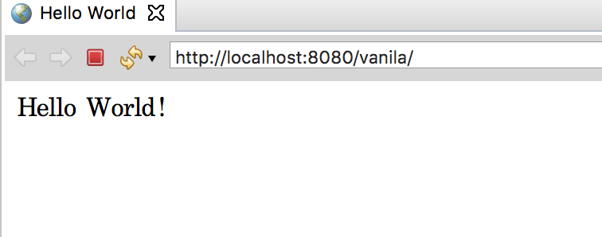

# 스프링 웹 프로젝트 자바 컨피그

## 스펙
- Maven
- Spring Web MVC Configuration using Java(not XML)
- JSP
- h2 Memory DB
- MyBatis
- lombok
- Spock (TBD)

## IntelliJ를 사용할 경우 (TBD)

## Eclipse를 사용할 경우

### 프로젝트 소스 내려받고, 메이븐 프로젝트로 변환

1. [Project Explorer] > Import > Import

2. Projects from Git 클릭

3. Clone URI

4. GitHub 정보 입력

5. 가지고 올 브랜치 체크
가지고 오고자 하는 브랜치들을 체크한다.
모두 다 체크해도 괜찮다.

6. 내려받은 소스를 저장시킬 위치를 지정한다.

7. Import as General Project
일단은 별도 추가 설정없이 소스만 내려받기 위해 General 프로젝트로서 다운로드 받도록 한다.

8. Finish 클릭하면 소스가 내려받아진다.

9. Maven 프로젝트로 변환

일단 아무설정 없이 General 프로젝트로 내려받았으므로 현재 시점에서 이 프로젝트는 컴파일도 안되고 의존성 라이브러리들도 다운로드도 안되는 그냥 단순 텍스트 파일에 불과하다.

그러나 이 프로젝트는 원래 maven 을 통해 의존성 라이브러리를 관리하고 있으며 빌드 및 패키징 설정도 관리하고 있으므로 Maven 프로젝트로 변환 해주어야 한다.

 변환이 정상적으로 잘 되었다면 프로젝트 아이콘 왼쪽 오른쪽에 M과 J 표시가 나타날 것이며 이클립스는 이 과정을 수행하며 의존성 라이브러리들(스프링 라이브러리, mybatis 라이브러리 등)을 운로드 받고, 컴파일 및 패키징 관련 프로젝트 설정또한 알아서 잡아준다.    

---

### 이클립스 롬복 설정

여기까지 잘 따라왔다면 일단 이클립스에 vanila-spring-config 프로젝트 설정을 1차적으로 완료한 셈이다.
그러나, 이 프로젝트에서는 getter/setter 자동 완성 등 편의성을 위해 lombok 이라는 라이브러리를 쓰고 있는데
이클립스의 경우 인텔리제이와 달리 롬복 사용을 위해 별도의 추가 설정을 해주어야 한다.

설치를 안한 상태에서는 `log.info` 로 시작하는 코드나.. `@Getter` `@Setter` 같은 코드에서 컴파일이 안된다고 빨간줄이 뜰 것이다,

이클립스 롬복 추가 설정 잡는 방법은 아래를 따라하도록 한다.

[이클립스 롬복 설치 방법](https://gist.github.com/queryholic/9b50b481a37a284cb3a74b3d81eb5e6d)

---

### 이클립스 톰캣 서버 연동 

[Servers 탭] > New > Server 를 통해 미리 받아놓은 톰캣 서버를 이클립스에 추가하여 프로젝트와 연동하도록 한다. 

아래와 같이 Hello World 를 출력하는 JSP 를 이용한 간단한 뷰 화면이 나올 것이다.  

또한, H2 Memory DB 에 넣어둔 데이터 2개가 로그에 찍히는 모습을 확인할 수 있다.

